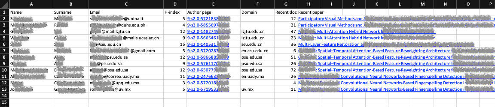

# Overview

This tool performs a search on the Scopus database for authors that work on a given topic. It is useful for looking up experts to invite for reviewing a paper.

The search looks for papers that fit some keywords, and filters them according to these criteria (configurable):
- The paper is recent
- The paper appeared in a journal
- The paper has been published by some specific publishers (e.g., IEEE, ACM)
- The paper belongs to the Computer Science category

Then, it returns a list of authors of these papers, filtering them according to these criteria:
- The author is still an active researcher (he/she authored a minimum number of papers in a recent time window)
- The author has some desired seniority (H-index should be within a given range)
- The author has no affiliation with some given institutions (to avoid conflicts)
- The author included an email address in the paper

The tool generates an Excel file `scopus_results.xlsx`, with the following information about the authors:
- Name and surname
- Email address
- H-index
- Total number of papers 
- A link to his/her profile on Scopus
- A link to his/her paper that fits the keywords




The tool uses Selenium and Google Chrome to scrape the email of the authors. You need to run Google Chrome with a remote debugging port enabled.

The tool can also analyze the authors of papers from a list (JSON or TXT). For example, you may want to analyze the authors of papers cited by a given paper.


# Setup

```
python3 -m venv env
source env/bin/activate
pip install -r requirements.txt
```

# Reviewer search by keywords (AND/OR separated)

```
python3 scopus_search.py -k "fault injection"
```

# Reviewer search by filtering publishers, by excluding conflits, and by looking-up email addresses

```
python3 scopus_search.py --publisher "mdpi,hindawi" --email-lookup --conflits "shanghai" -k "computer vision"
```

Google Chrome needs to be running with a remote debugging port, and already logged-in into Scopus:
```
/Applications/Google\ Chrome.app/Contents/MacOS/Google\ Chrome --remote-debugging-port=8989  www.scopus.com
```

# Reviewer search by references (JSON format generated from anystyle)

```
sudo gem install anystyle-cli
anystyle find file.pdf > references.json

python3 scopus_search.py -j references.json
```

# Reviewer search by references (TXT format, plain titles)

```
python3 scopus_search.py -t references.txt
```


